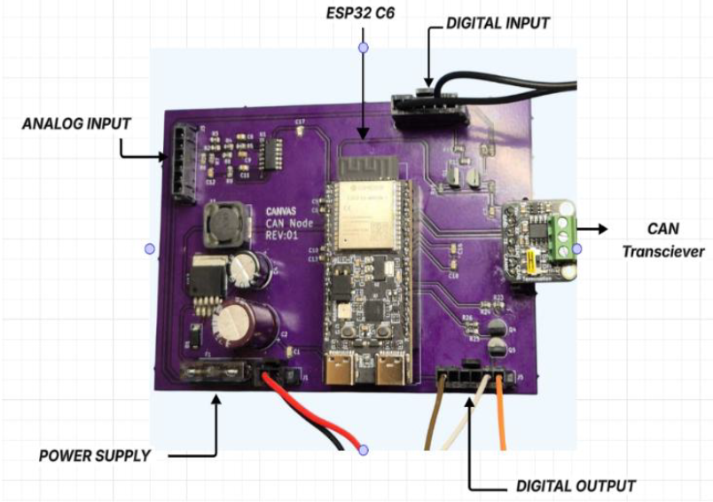

# ESP32_CAN_Node
This repository documents the design and development of a compact ESP32-based CAN I/O node built for industrial control applications
The board is engineered to safely interface 24 V digital and analog signals with a low-voltage microcontroller while communicating over the CAN bus. This public overview highlights design methodology and validation steps. (Schematics, firmware, and manufacturing files are omitted due to confidentiality.)

## System Architecture

The PCB is structured into four primary subsystems:
1. Power Regulation (24 V → 3.3 V buck converter stage)
2. Digital I/O conditioning using MOSFET level shifters
3. Analog input conditioning using op-amp-based scaling and filtering
4. CAN communication and physical layer integration

The design uses the ESP32 as the controller with an onboard CAN transceiver to interface with a distributed industrial network.

Figure: Annotated top-view showing subsystems of the CAN node PCB

## Signal Conditioning and Interface Design

**Digital Inputs/Outputs**  
The board uses BS170-based MOSFET level shifting for 24 V digital inputs and outputs. The MOSFET stage ensures logic compatibility and input protection while maintaining fast switching edges.

**Analog Inputs**  
Two analog inputs are conditioned using an MCP6004 op-amp configured for buffering and scaling. LTspice simulations were used to determine RC component values and cutoff frequencies before hardware validation. Bode plots were used to confirm bandwidth and filtering response under expected load conditions.

## Power Regulation

A buck converter stage steps 24 V down to 3.3 V for the ESP32 domain. Component sizing and thermal headroom were validated using LTspice prior to layout, followed by bench testing with DMM and oscilloscope measurements.

## CAN Communication Testing

CAN functionality was validated using the TJA1051T transceiver, communicating with both sensors and a PC interface via PCAN. The physical layer was tested for correct dominant/recessive transitions, termination consistency, and timing under traffic. End‑to‑end message integrity was confirmed before integrating the design into the rest of the control system.

## Design and Bring-Up Process

- Early-stage LTspice simulations informed component selection for analog, digital, and power domains
- Manual prototyping of signal-conditioning subcircuits confirmed with oscilloscope measurements
- Schematic capture and PCB layout completed in KiCad
- PCB manufactured and assembled using SMT/THT techniques
- Board-level validation performed for each subsystem (digital in/out, analog in, power rail stability, and CAN bus communication)

## Repository Contents

This repository contains:
Images folder with the following content:- 
- PCB layout image
- 3D View of the board

A folder with an image specifying the features of the board

It does **not** contain:
- Schematic source files
- Gerbers or manufacturing files
- Firmware source
- BOM or vendor information

These materials are proprietary to the sponsoring company.

## Author

This board was developed as part of an internship project focused on distributed industrial control. It reflects hands-on experience across schematic design, PCB layout, simulation, bring-up, and hardware validation in a lab setting.
